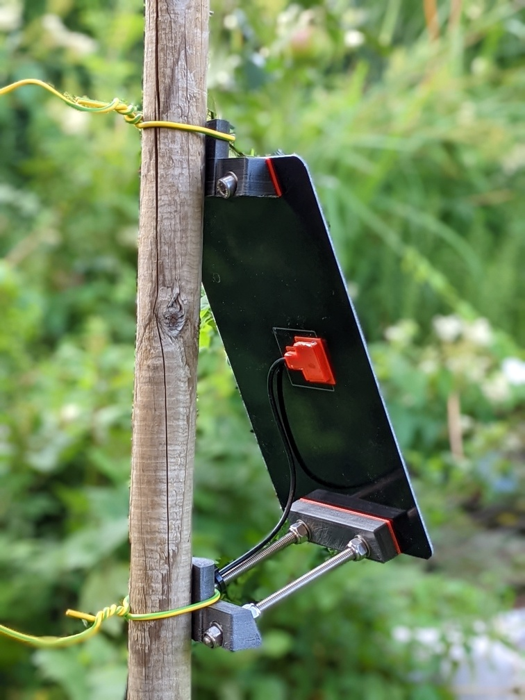

# Useful 3d printable parts

This directory contains stl files and their FreeCAD/OpenSCAD sources,
mainly created for the [ECS Case based groundstation](/_02pcb/ECSCase%20Board), but also useful for others.

## Solar panel
[Used solar panels](https://www.aliexpress.com/item/32890517531.html)

### Glue cover for electrical connections
[solar_panel_glue.stl](solar_panel/electrical_connection/solar_panel_glue.stl), 
[solar_panel_glue_top.stl](solar_panel/electrical_connection/solar_panel_glue_top.stl)

1. Print parts, preferable in TPU or similar flexible material as it will fit tight around the cable without having to drill the whole for slightly larger cables. Also TPU allows to remove extra material easily in case the outer part is higher than necessary.
2. Solder cable to connectors.
3. Clean area properly using alcohol, especially from soldering residues and fingerprints.
4. Pull cable trough the printed outer part, position the part properly and use some tape to keep it in place temporarily.
5. Fill with 2-component epoxy glue until the cable and connectors are submerged (wear apprpriate gloves, mask, glasses!).
6. Drop top part on the glue, try to avoid having air bubbles under it.
7. Let it dry, if needed cut the sides of the outer part to keep them flat with the top part in case you did not fill it completely with glue. For TPU a sharp knive should be all you need. For harder material, carefully sanding it down might be an option.

### Mast/pole mount
## Other parts
### 20.5mm washer
[flex_washer_20.5mm.stl](other_parts/flex_washer_20.5mm.stl): Printed in TPU or similar flexible Material, this serves as water-tightening washer
on the outside of the case when using the [waterproof RJ11 connector](https://www.aliexpress.com/item/1005004064498188.html).
